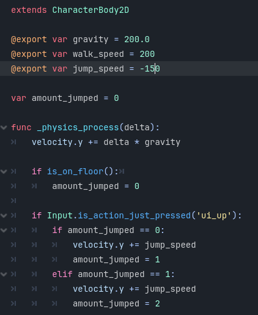
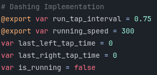
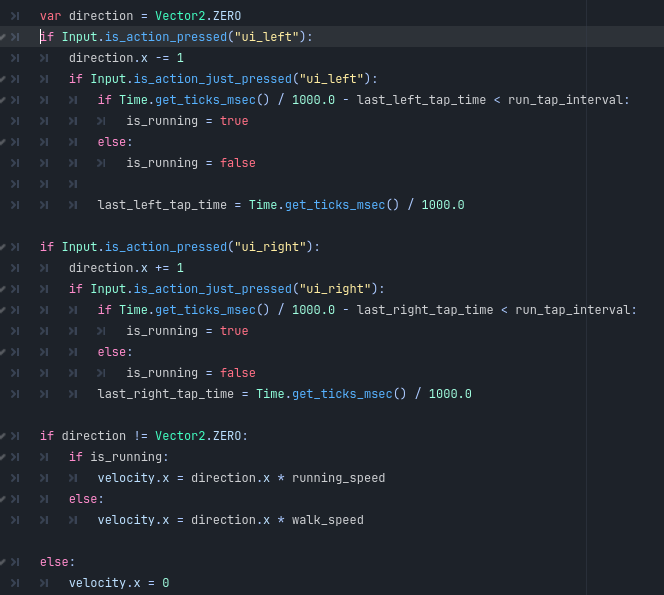
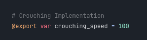
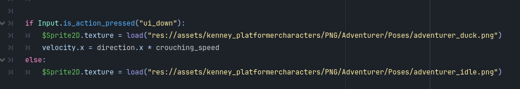

# Tutorial 3 Game Development

**Nama :** Yosua Chrial Martono

**NPM :** 2106750686

## Latihan Mandiri

-   **Double Jump**:

    

    Untuk double jump, saya menambahkan sebuah variabel baru yaitu `amount_jumped`. Variabel ini berfungsi untuk mencatat berapa kali player telah melompat.

    Behaviour yang ingin saya terapkan adalah player bisa double jump sekali dan Ia bisa melakukannya setiap kali telah menyentuh lantai. Sehingga `amount_jumped` akan selalu direset apabila player berada di lantai. Hal ini kemudian akan dievaluasi setiap game loop sehingga ketika player baru lompat pertama kali `amount_jumped` akan diincrement sekali dan ketika Ia telah double jump maka amountnya akan diincrement lagi. Conditional dibuat sehingga ketika `amount_jumped` bukan lagi 0 atau 1 maka input up player tidak akan ditranslasikan ke loncatan yang baru.

    Salah satu hal lain yang saya ubah adalah mengubah cara nilai `velocity.y` diubah. Pada awalnya di latihan ini nilai tersebut diubah dengan diganti nilainya, tapi hal ini tidak cocok dengan konsep double jump yang ingin saya implementasikan. Sehingga untuk double jump saya beralih ke menambahkan jump speed ke `velocity.y` yang berhasil mengsimulasikan double jump.

-   **Dashing**:

    References:
    https://www.youtube.com/watch?v=GpLy_e1s14A

    Untuk latihan ini saya menggunakan referensi yang saya temukan di google. Untuk memenuhinya ada beberapa hal yang diubah dari implementasi awal.

    Pertama-tama saya menambahkan beberapa variabel baru yang memengaruhi kecepatan berlari, waktu dan interval key presses, dan `is_running` yang akan dijelaskan di gambar selanjutnya.

    

    Untuk implementasi ini, saya mengubah sistem pergerakan secara horizontal sehingga menggunakan Vector2 sebagai arah bergerak sesuai dengan tutorial yang diikuti. Hal ini sebenarnya tidak terlalu diperlukan karena masing-masing bagian bisa langsung diganti dengan kita mengassign velocity value yang baru ke sumbu x. Namun, dengan menggunakan pendekatan ini kode menjadi lebih modular dan dapat mengurangi line of code yang digunakan.

    Konsep dasar pada implementasi ini adalah, ketika tombol kanan atau kiri dipencet, apakah interval kedua aksi tersebut cukup cepat sehingga bisa mentrigger _dashing_ pada karakter. Hal ini dimampukan dengan penggunaan Time.get_ticks_msec yang mencatat waktu disaat tombol dipencet. Ketika interval kedua aksi memenuhi interval yang ditetapkan maka status `is_running` akan menjadi `true` dan ketika `velocity.x` dihitung kecepatan yang akan diterapkan adalah kecepetan berlari ketimbang berjalan.

    

-   **Crouching:**
    Referensi:

    -   https://docs.godotengine.org/en/4.3/classes/class_@gdscript.html
    -   https://docs.godotengine.org/en/4.3/classes/class_sprite2d.html
    -   https://docs.godotengine.org/en/4.3/classes/class_texture2d.html

    Untuk implementasi crouching saya menggunakan sistem direction yang sudah ada sebelumnya dan menggunakannya untuk menerapkan `crouching_speed` kepada player apabila Ia bergerak sambil menahan down button.
    
    

    Saya juga mengubah texture sprite ketika ia sedang crouching dengan mengakses texture dari sprite dan load texture baru ketika crouch sedang aktif.
