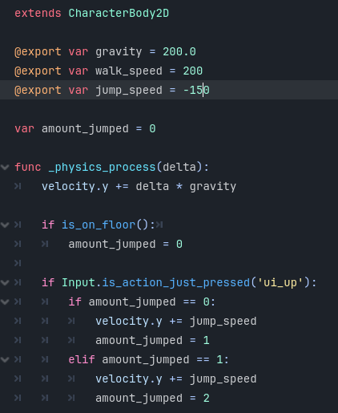
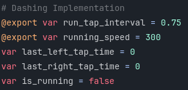
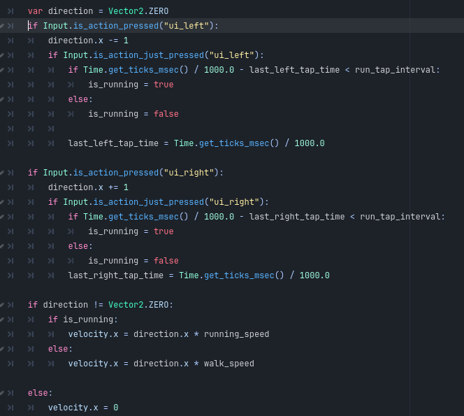
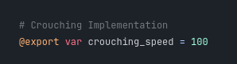
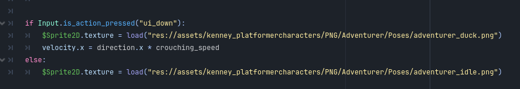

**Nama :** Yosua Chrial Martono

**NPM :** 2106750686

# Tutorial 3 Game Development

## Latihan Mandiri

-   **Double Jump**:

    

    Untuk double jump, saya menambahkan sebuah variabel baru yaitu `amount_jumped`. Variabel ini berfungsi untuk mencatat berapa kali player telah melompat.

    Behaviour yang ingin saya terapkan adalah player bisa double jump sekali dan Ia bisa melakukannya setiap kali telah menyentuh lantai. Sehingga `amount_jumped` akan selalu direset apabila player berada di lantai. Hal ini kemudian akan dievaluasi setiap game loop sehingga ketika player baru lompat pertama kali `amount_jumped` akan diincrement sekali dan ketika Ia telah double jump maka amountnya akan diincrement lagi. Conditional dibuat sehingga ketika `amount_jumped` bukan lagi 0 atau 1 maka input up player tidak akan ditranslasikan ke loncatan yang baru.

    Salah satu hal lain yang saya ubah adalah mengubah cara nilai `velocity.y` diubah. Pada awalnya di latihan ini nilai tersebut diubah dengan diganti nilainya, tapi hal ini tidak cocok dengan konsep double jump yang ingin saya implementasikan. Sehingga untuk double jump saya beralih ke menambahkan jump speed ke `velocity.y` yang berhasil mengsimulasikan double jump.

-   **Dashing**:

    References:
    https://www.youtube.com/watch?v=GpLy_e1s14A

    Untuk latihan ini saya menggunakan referensi yang saya temukan di google. Untuk memenuhinya ada beberapa hal yang diubah dari implementasi awal.

    Pertama-tama saya menambahkan beberapa variabel baru yang memengaruhi kecepatan berlari, waktu dan interval key presses, dan `is_running` yang akan dijelaskan di gambar selanjutnya.

    

    Untuk implementasi ini, saya mengubah sistem pergerakan secara horizontal sehingga menggunakan Vector2 sebagai arah bergerak sesuai dengan tutorial yang diikuti. Hal ini sebenarnya tidak terlalu diperlukan karena masing-masing bagian bisa langsung diganti dengan kita mengassign velocity value yang baru ke sumbu x. Namun, dengan menggunakan pendekatan ini kode menjadi lebih modular dan dapat mengurangi line of code yang digunakan.

    Konsep dasar pada implementasi ini adalah, ketika tombol kanan atau kiri dipencet, apakah interval kedua aksi tersebut cukup cepat sehingga bisa mentrigger _dashing_ pada karakter. Hal ini dimampukan dengan penggunaan Time.get_ticks_msec yang mencatat waktu disaat tombol dipencet. Ketika interval kedua aksi memenuhi interval yang ditetapkan maka status `is_running` akan menjadi `true` dan ketika `velocity.x` dihitung kecepatan yang akan diterapkan adalah kecepetan berlari ketimbang berjalan.

    

-   **Crouching:**
    Referensi:

    -   https://docs.godotengine.org/en/4.3/classes/class_@gdscript.html
    -   https://docs.godotengine.org/en/4.3/classes/class_sprite2d.html
    -   https://docs.godotengine.org/en/4.3/classes/class_texture2d.html

    Untuk implementasi crouching saya menggunakan sistem direction yang sudah ada sebelumnya dan menggunakannya untuk menerapkan `crouching_speed` kepada player apabila Ia bergerak sambil menahan down button.
    
    

    Saya juga mengubah texture sprite ketika ia sedang crouching dengan mengakses texture dari sprite dan load texture baru ketika crouch sedang aktif.

-   **Polishing:**

    -   Animation
        References:
        https://www.youtube.com/watch?v=-f1bHR0iiEY

        Menggunakan referensi ini saya membuat animasi untuk beberapa aksi dalam game. Berjalan, berlari, melompat, jatuh, dan idle. Dalam game ini saya juga menggunakan sprite adventurer dari asset folder untuk animasi.

    -   Facing

        Saya mengubah arah hadap dari player dengan menggunakan direction dari input user.

    -   Background

        Saya menambahkan simple background menggunakan TextureRect untuk mengganti background kosong yang digunakan di awal.

# Tutorial 5 Game Development

Dalam tutorial ini ada beberapa hal yang saya lakukan karena adanya task yang bertabrakan dengan polishing yang saya lakukan di tutorial 3. Salah satunya adalah penerapan animation sehingga saya menggunakan implementasi yang sudah ada dan mengganti sprite yang digunakan dari hasil pekerjaan tutorial 3.

## Latihan Mandiri:

-   Menambahkan objek background smoke, menggunakan aset yang ditemukan di itch.io.

    -   Menggunakan semua frame di dalam animation dan menambahkannya ke suatu node animationsprite beserta dengan soundplayer untuk menambahkan sound effect
    -   Suara ditambahkan effect maxdistance sehingga jarak pemain berpengaruh

-   Menambahkan objek koin yang diperlukan untuk spawn win flag
    -   memainkan sfx coin ketika player pick up
-   Menambahkan objek flag yang diperlukan untuk menang
    -   memainkan sfx win ketika player menyentuhnya
    -   memainkan win scene
-   Menambahkan background music dari internet

## Polishing

-   Menambahkan tile baru menggunakan tile map yang dipelajari di tutorial 4 untuk mempermudah level design
-   Menggunakan camera2d yang diassign ke characther
-   Menambahkan background

Credits:

-   lg fire5.wav by lgarrett -- https://freesound.org/s/17150/ -- License: Attribution 3.0
-   "Space Jazz" Kevin MacLeod (incompetech.com)
    Licensed under Creative Commons: By Attribution 4.0 License
    http://creativecommons.org/licenses/by/4.0/
-   Jingle_Win_01.wav by LittleRobotSoundFactory -- https://freesound.org/s/270319/ -- License: Attribution 4.0
-   Nintendo Coin Pickup by plasterbrain -- https://freesound.org/s/608433/ -- License: Creative Commons 0
